# ReviewFlow: Admin Role & Capabilities Guide

> **Document Version:** 1.0  
> **Audience:** Business Owners, Venue Managers, Franchise Operators, Customer Experience (CX) Leads  
> **System Module:** Admin Operations Console (`/admin`)

---

## 1. Role Overview & Purpose

The **Admin** role in ReviewFlow is designed for operators who manage one or more physical business locations (restaurants, clinics, hotels, auto centers, salons, retail, or professional services). 

### Primary Objectives:
1. **Accelerate Google Reviews:** Generate high-resolution, branded physical QR assets for tables, checkout counters, and receipt slips.
2. **Eliminate Customer Friction:** Provide visitors with a 15-second AI-assisted review drafting workflow that automatically buffers to their device clipboard.
3. **Protect Public Rating (Grievance Deflection):** Intercept dissatisfied customers (1–3 stars) into a private internal feedback inbox, allowing management to resolve complaints before they become public Google reviews.
4. **Monitor Performance & ROI:** Track real scan counts, AI drafting engagements, Google Maps redirects, and star-rating distributions.

---

## 2. Admin Feature Matrix

```mermaid
flowchart TD
    Admin["Admin / Venue Manager"] --> A["1. Location Management"]
    Admin --> B["2. QR Code & Print Studio"]
    Admin --> C["3. Performance & Funnel Analytics"]
    Admin --> D["4. Private Grievances Inbox"]
    Admin --> E["5. AI Review Tag Tuning"]

    A --> A1["Link Google Place ID"]
    A --> A2["Multi-Location Switcher"]
    A --> A3["Test Google Review Scheme"]

    B --> B1["Encode Dynamic URL (/review?placeId=...&name=...)"]
    B --> B2["Download 300 DPI Print Sign (PNG)"]
    B --> B3["Copy Direct Link for SMS / Receipts"]

    C --> C1["Track Real Scans"]
    C --> C2["Track AI Draft Engagements"]
    C --> C3["Track Google Maps Handoffs"]
    C --> C4["Calculate Conversion Rate %"]

    D --> D1["Capture 1-3 Star Complaints Privately"]
    D --> D2["View Customer Contact Info"]
    D --> D3["Workflow Status: New / Contacted / Resolved"]

    E --> E1["Set Custom Attribute Highlight Chips"]
    E --> E2["Calibrate Tone & Vocabulary by Category"]
```



---

## 3. Detailed Admin Capabilities

### 3.1 Google Place ID & Location Configuration
- **Connect Google Place ID:** Link the exact Google Place ID matching the Google Business Profile (e.g. `ChIJN1t_tDeuEmsRUsoyG83frY4`).
- **Deep-Link Validation:** Test the direct write review dialog (`https://search.google.com/local/writereview?placeid=<ID>`) with a single click to ensure customers land on the official Google submission modal.
- **Multi-Tenant / Multi-Branch Management:**
  - Create and manage independent locations under one console.
  - Switch between active locations instantly via the location selector dropdown.
  - Remove decommissioned locations with automatic cleanup.

### 3.2 QR Code Generator & High-Resolution Print Export
- **Dynamic URL Generation:** Automatically encodes the high-error-correction (`level="H"`) QR URL:
  ```text
  https://<domain>/review?placeId=<GOOGLE_PLACE_ID>&name=<BUSINESS_NAME>
  ```
- **300 DPI Canvas PNG Export:**
  - Renders a print-ready 800x1100 px branded sign composite.
  - Features the venue name, gold 5-star graphic, scannable QR code, call-to-action (*"Scan to review us on Google"*), and 3-step customer micro-instructions.
  - Ready for acrylic table stands, counter stands, window decals, or checkout cards.
- **Direct Link Sharing:** 1-click clipboard copy of the customer review link for insertion into digital receipts, SMS follow-ups, or email invoices.

### 3.3 Analytics & Review Conversion Funnel
The admin console tracks true client events starting from actual zero without simulated data:
- **Total QR Scans:** Total page impressions triggered by customer QR scans.
- **AI Reviews Drafted:** Number of customers who used the AI drafting engine to generate an authentic review.
- **Google Maps Handoffs:** Number of customers who successfully copied their review and launched the Google review dialog.
- **Conversion Rate:** `(Google Maps Handoffs / Total QR Scans) * 100` calculated in real time.
- **Rating Breakdown Histogram:** Real-time distribution across 5★, 4★, 3★, 2★, and 1★ ratings.
- **Deflected Review Counter:** Number of low-rating visits successfully intercepted into private resolution.

### 3.4 Private Customer Grievances Inbox (Negative Review Shield)
When a customer selects **1, 2, or 3 stars**, the customer-facing interface gracefully pivots to an internal feedback form:
- **Data Captured:**
  - Customer name and contact information (phone number or email).
  - Selected issue tags (e.g., *Service delay*, *Staff interaction*, *Quality below expectation*, *Cleanliness*, *Billing question*).
  - Detailed message explaining what occurred.
  - Timestamp and star rating.
- **Status Workflow:**
  - Admins can update the resolution state:
    - `New`: Unreviewed customer complaint requiring attention.
    - `Contacted`: Manager has reached out to customer via phone/email with an apology or resolution.
    - `Resolved`: Issue closed; customer satisfaction recovered.
- **Public Rating Protection:** Prevents minor operational hiccups from escalating into permanent 1-star public Google reviews.

### 3.5 AI Review Tag & Tone Customization
- **Attribute Chip Management:** Admins can define the custom highlight chips customers see when drafting a review (e.g. *"Prompt service"*, *"Clean premises"*, *"Attentive staff"*, *"Fair pricing"*).
- **Tone Conditioning:** The review generation engine adapts to the venue's category (Restaurant, Cafe, Clinic, Hotel, Auto, Salon, Professional Services) to produce natural, human-sounding reviews free of AI clichés.

---

## 4. Operational Best Practices for Admins

1. **Test Place ID First:** Always use the *"Test Google Place Review Dialog"* link in the admin console to verify that the Place ID triggers the native Google review box for your business.
2. **Optimal QR Placement:** Place printed acrylic stands at checkout counters, table tent cards at dining tables, or on the back of payment folios where customer dwell time is highest.
3. **Monitor the Grievance Inbox Daily:** Review any `New` submissions under the *Feedback Inbox* tab promptly. Contacting an unhappy customer within 24 hours converts up to 70% of dissatisfied visitors into loyal patrons.
4. **Tune Attribute Chips Seasonally:** Update the custom attribute chips in *Place Settings* to highlight new services, menu items, or seasonal offerings.

---

## 5. Summary of System Routes for Admins

| Page / Endpoint | Purpose | Access |
| :--- | :--- | :--- |
| [`/admin`](file:///C:/Desktop/New%20folder%20%283%29/app/admin/page.tsx) | Central Admin Operations Console (Analytics, QR Studio, Feedback Inbox, Place Settings) | Venue Management |
| [`/review`](file:///C:/Desktop/New%20folder%20%283%29/app/review/page.tsx) | Customer-facing review landing page (dynamically driven by `?placeId=...&name=...`) | Public Customers (via QR) |
| [`POST /api/generate-review`](file:///C:/Desktop/New%20folder%20%283%29/app/api/generate-review/route.ts) | LLM review drafting endpoint (`{ businessName, rating, tags }`) | System API |
| [`POST /api/feedback`](file:///C:/Desktop/New%20folder%20%283%29/app/api/feedback/route.ts) | Private grievance capture endpoint for 1-3 star reviews | System API |
