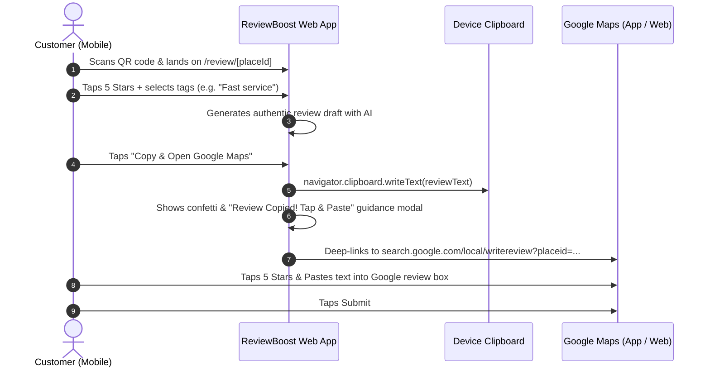

# ReviewBoost AI — Google Maps Review Booster & Handoff Engine

> A mobile-first, production-ready web application engineered to dramatically increase Google Maps reviews through physical QR codes, AI-assisted review drafting, frictionless 1-tap clipboard handoffs, and private grievance deflection.

---

## 1. Executive Summary & Problem-Solution Architecture

### The Problem
- **Customer Typing Friction:** Customers are happy to support local businesses, but staring at a blank mobile review text box leads to drop-offs.
- **Google Security Sandbox Constraints:** Due to Google cross-origin iframe security, CORS policies, and native OS app sandboxing, **no third-party application can programmatically type or pre-fill the native Google Maps review textarea**.
- **Public Negative Reviews:** Customers with minor grievances (e.g. slow service on a busy night) often leave public 1-to-3-star reviews on Google Maps because they lack a private, direct channel to management.

### The Solution: ReviewBoost AI
1. **Dynamic Physical QR Codes:** Place table tents, counter cards, receipt cards, or window decals that deep-link directly into the business's custom review flow.
2. **AI-Assisted Review Drafting:** When a customer selects 4 or 5 stars, AI drafts an authentic, natural, first-person review based on their business category, selected highlight tags, and chosen tone (Casual, Enthusiastic, Professional, Short).
3. **The 1-Tap Clipboard Handoff:** 
   - Copies the review text to the device clipboard (`navigator.clipboard.writeText` with legacy fallback).
   - Shows an instant animated visual walkthrough HUD: *"Review copied! Tap 5 stars & paste."*
   - Deep-links directly to Google's official Local WriteReview dialog:
     `https://search.google.com/local/writereview?placeid=<PLACE_ID>`
4. **Negative Review Shielding (1-3 Stars):** Dissatisfied customers are seamlessly routed to a private internal feedback form sent directly to management, protecting the public Google Maps rating while facilitating prompt customer recovery.
5. **Multi-Tenant Admin Dashboard:** Business owners can switch between locations, customize tags and Place IDs, view conversion analytics, download printable high-res QR cards (Table Tents, Counter Stands, Receipt Inserts), and test the customer journey inside an interactive smartphone simulator.

---

## 2. Project Directory Structure

```text
├── app/
│   ├── admin/
│   │   └── page.tsx              # Admin portal for business owners
│   ├── api/
│   │   ├── feedback/
│   │   │   └── route.ts          # Endpoint to capture private grievances
│   │   └── generate-review/
│   │       └── route.ts          # LLM review generator (OpenAI + anti-robotic fallback)
│   ├── review/
│   │   ├── [placeId]/
│   │   │   └── page.tsx          # Dynamic route for specific Google Place ID
│   │   └── page.tsx              # Query route: ?placeId=...&businessName=...
│   ├── globals.css               # Tailwind CSS styles & @media print rules
│   ├── layout.tsx                # Root layout with mobile-first viewport
│   └── page.tsx                  # Marketing homepage & live industry showcases
├── components/
│   ├── AdminDashboard.tsx        # Multi-tenant admin, analytics funnel & profile editor
│   ├── Navbar.tsx                # Top navigation
│   ├── QrCodeCard.tsx            # Printable QR Code studio & canvas download
│   ├── ReviewFlow.tsx            # Customer review UI with star rating & AI drafter
│   ├── ReviewPageClient.tsx      # Client wrapper for review pages & dynamic place loading
│   └── StarRating.tsx            # Interactive touch-friendly 5-star rating component
├── lib/
│   ├── business-store.ts         # Sample business profiles, category tags & analytics store
│   ├── google-maps-utils.ts      # Deep link builders & clipboard copying utilities
│   ├── prompt-templates.ts       # AI prompt engineering templates & fallback engine
│   └── types.ts                  # TypeScript domain models
├── public/                       # Static public assets
├── package.json
├── tsconfig.json
└── next.config.ts
```

---

## 3. Prompt Engineering Specification for AI Review Generation

Located in [`lib/prompt-templates.ts`](file:///C:/Desktop/New%20folder%20%283%29/lib/prompt-templates.ts).

### System Prompt
```text
You are a helpful assistant assisting a genuine customer in drafting a Google Maps review for a business they just visited.

CRITICAL RULES:
1. Write in the first-person ("I", "we", "my family").
2. Write naturally and conversationally, matching the way real people write mobile reviews on Google Maps.
3. NEVER use generic AI cliches or overly formal phrasing such as:
   - "I recently had the pleasure of visiting..."
   - "Nestled in the heart of..."
   - "In conclusion..." / "All in all..."
   - "A testament to excellence..."
   - "Look no further..."
   - "From the moment I walked in..."
4. Incorporate the user's selected tags and any custom notes seamlessly into the narrative without merely listing them.
5. Keep the review concise, punchy, and mobile-friendly (typically 2 to 5 sentences depending on requested length).
6. Match the requested tone (Casual, Enthusiastic, Professional, or Concise).
7. Return ONLY the plain text of the review. Do not wrap in quotes or preface with "Here is your review:".
```

### Tone Directives
| Tone | Directive | Example Output |
| :--- | :--- | :--- |
| **Casual** | Friendly, down-to-earth, sounds like a recommendation to a friend. | *"Really enjoyed my visit to The Rustic Table Bistro! The truffle pasta was spot on and service was super quick. Definitely coming back soon."* |
| **Enthusiastic** | High energy, genuine excitement, natural exclamation. | *"Hands down one of the best dinners I've had in a long time! The flavors were incredible and the staff was so welcoming. 5 stars all the way!"* |
| **Professional** | Polite, well-structured, focuses on quality, efficiency, competence. | *"Consistently impressed with the standards at Lumina Dental. Highly professional staff and virtually painless treatment. Recommended."* |
| **Concise** | Short & punchy (2 sentences max) for fast reviewers. | *"Top notch experience at Apex Auto Care. Honest pricing and fast turnaround. Will definitely be back!"* |

---

## 4. Google Maps Integration & Hand-Off Specification

Located in [`lib/google-maps-utils.ts`](file:///C:/Desktop/New%20folder%20%283%29/lib/google-maps-utils.ts) & [`components/ReviewFlow.tsx`](file:///C:/Desktop/New%20folder%20%283%29/components/ReviewFlow.tsx).

### Technical Deep Link Strategy
1. **Direct Google Review Dialog URL:**
   ```text
   https://search.google.com/local/writereview?placeid=<GOOGLE_PLACE_ID>
   ```
   When opened on mobile (iOS/Android), this link prompts the device to launch the native Google Maps app or mobile web view directly on the star-rating and review submission sheet.

2. **Android Intent URI Scheme (App Deep-Link):**
   ```text
   intent://search.google.com/local/writereview?placeid=<PLACE_ID>#Intent;scheme=https;package=com.google.android.apps.maps;end
   ```

3. **Fallback Query Search:**
   ```text
   https://www.google.com/maps/search/?api=1&query=<BUSINESS_NAME>
   ```

### Clipboard Handoff Execution Flow


---

## 5. Getting Started & Installation

### Prerequisites
- Node.js `v18.17.0+` (tested on Node `v22.18.0`)
- npm `v9+`

### Installation
```bash
# Clone the repository and navigate into the directory
cd "google-review-booster"

# Install dependencies
npm install

# Run the development server
npm run dev

# Or build and launch the production server
npm run build
npm run start
```
The application will be live at `http://localhost:3000`.

### Environment Variables (Optional)
To use live OpenAI GPT-4o-mini generation, create `.env.local`:
```env
OPENAI_API_KEY=sk-...your-openai-api-key...
```
*(Note: If no API key is provided, the application automatically uses its built-in anti-robotic generative fallback engine, functioning 100% offline out-of-the-box!)*

---

## 6. Live Demo Pages & Verification URLs

- **Homepage & Industry Showcase:** `http://localhost:3000/`
- **Admin Dashboard:** `http://localhost:3000/admin`
- **Restaurant Customer Flow:** `http://localhost:3000/review/rustic-table`
- **Dental Studio Customer Flow:** `http://localhost:3000/review/lumina-dental`
- **Boutique Hotel Customer Flow:** `http://localhost:3000/review/serene-palms`
- **Auto Care Customer Flow:** `http://localhost:3000/review/apex-auto`
- **Dynamic Google Place Query:** `http://localhost:3000/review?placeId=ChIJN1t_tDeuEmsRUsoyG83frY4&businessName=Google+Sydney`
